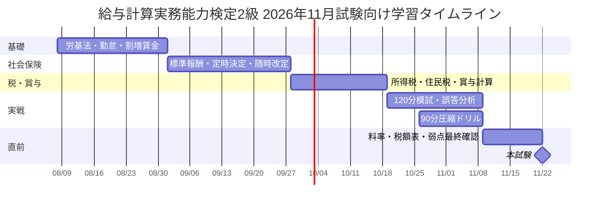

# 給与計算実務能力検定２級 本番対応・模擬試験パッケージ

> 出典の実URLと自動検証の範囲は [content-sources.md](content-sources.md) を参照。本文中の `turn...` 形式の引用記号は調査時の記録であり、外部から参照できる出典リンクではない。

## エグゼクティブサマリー

本パッケージは、**2026年11月実施の「給与計算実務能力検定２級」受験を想定**し、公式に公表されている試験形式、公式出題範囲、公式問題例・資料集の構成、2026年8月時点で確認できる厚生労働省・国税庁・日本年金機構・全国健康保険協会等の一次資料を基に、**新規作成したオリジナル模擬試験**である。公式２級は、知識問題35問＋計算問題5問の計40問、120分、四肢択一マークシート方式で、知識問題2点×35問＝70点、計算問題6点×5問＝30点、合計100点。合格基準は70％以上である。2026年11月試験については、原則として**2026年9月1日時点で施行されている法令等**が基準となる。 citeturn23view0turn23view1

特に重要な注意点は、ユーザー指定に含まれる**「年末調整」は公式２級の本来の試験範囲ではない**ことである。公式の級別定義では、２級は「年末調整以外の通常の給与計算と賞与の計算」ができる水準であり、年末調整は１級範囲として明示されている。したがって、本パッケージでは**Q1～Q40を公式２級準拠の本番模試、Q41～Q48を年末調整等の発展・記述演習**として分離した。これにより公式形式を崩さず、同時に依頼された年末調整・記述問題も網羅している。 citeturn23view0turn23view1

公式は分野ごとの問題数や配点比率を公表していないため、本模試では公式が列挙する「勤怠項目、支給項目、控除項目、社会保険手続、賞与計算、労働法令、社会保険制度」を基礎に、実務上の重要性と計算問題との接続を考慮して独自配分した。公式２級範囲には、勤怠、割増賃金、非課税通勤費、社会保険料、所得税、住民税、標準報酬月額、定時決定、随時改定、賞与、労働基準法、健康保険、厚生年金、雇用保険等が明記されている。 citeturn23view0

公式は現在の本試験問題・模範解答を一般公開しておらず、公式サイトでは2014年実施試験からの問題例とサンプル資料集が公開されている。現在の試験でも計算問題用の「資料集」が配布されるため、本模試も「料率・税額表を正しく参照して計算する」能力を重視している。 citeturn19view3turn23view1

## 試験仕様と模擬試験の設計前提

公式２級の仕様は、職業技能振興会FOSおよび実務能力開発支援協会の双方で、40問・120分、知識35問、計算5問、全問四肢択一、100点満点、70％以上合格として確認できる。公式ページでは、2026年11月22日の２級試験も案内されている。 citeturn23view0turn23view1

| 項目 | 公式に確認できる仕様 | 本パッケージ |
|---|---|---|
| 問題数 | 40問 | 本番模試40問＋発展8問 |
| 試験時間 | 120分 | 本番120分。別途90分圧縮演習可 |
| 知識問題 | 35問、四肢択一 | Q1～Q35 |
| 計算問題 | 5問、四肢択一 | Q36～Q40 |
| 記述問題 | **２級にはなし** | Q41、Q45、Q47等を発展演習として追加 |
| 知識問題配点 | 1問2点、計70点 | 同一 |
| 計算問題配点 | 1問6点、計30点 | 同一 |
| 合格基準 | 70％以上 | 70点を公式基準相当とする |
| 分野別公式配点 | **非公表・未指定** | 下表の独自配分 |
| 年末調整 | **公式２級範囲外** | Q41～Q47で発展学習 |
| 法令基準日 | 11月試験は同年9月1日 | 2026年9月1日基準を想定 |
| 計算資料 | 本番で資料集配布 | 2026年公的料率・税額表を使用 |

公式２級では「給与計算の基本的知識」「社会保険手続の基本的知識」「賞与計算」「給与計算実務に関連する労働法令」「社会保険制度」が学習対象として列挙され、さらに勤怠、支給、控除、住民税、標準報酬、資格取得時決定、定時決定、随時改定等が具体的に示されている。一方、**各項目が本番で何問ずつ出るかは公開されていない**。 citeturn23view0

そこでQ1～Q40は次のように設計した。

| 採点上の主分野 | 知識問題 | 計算問題 | 問題数 | 配点 | 本模試比率 |
|---|---:|---:|---:|---:|---:|
| 労働法・勤怠 | Q1～Q11 | Q36 | 12 | 28点 | 28% |
| 給与基礎・支給控除 | Q12～Q15 | Q40 | 5 | 14点 | 14% |
| 税・源泉・住民税 | Q16～Q21 | Q38～Q39 | 8 | 24点 | 24% |
| 社会保険 | Q22～Q35 | Q37 | 15 | 34点 | 34% |
| **合計** | **35問** | **5問** | **40問** | **100点** | **100%** |

この比率は**公式配点ではない**。公式出題範囲の広さと、実際の給与計算で税・社会保険の料率表を参照して計算する重要性を反映した本模試独自の設計である。公式問題例でも知識問題と給与・賞与の計算問題が組み合わされ、現在の本番では計算用資料集が配布される。 citeturn19view3turn23view1

難易度はQ1～Q40で概ね「易19問・中18問・難3問」とし、**基本論点を確実に取るだけでは70点前後、制度横断・計算まで安定すれば80～90点台を狙える**設計とした。これは公式の難易度区分ではなく、本模試上の学習診断基準である。

2026年の料率について、本模試の計算では東京都・協会けんぽを指定した問題に限り、健康保険9.85％、介護保険該当者の健康保険＋介護保険11.47％、子ども・子育て支援金0.23％、厚生年金18.3％を使用する。協会けんぽ表では40～64歳を介護保険第2号被保険者とし、被保険者負担の端数処理、標準賞与額、各上限も示されている。 citeturn17view0turn22view3

2026年度の雇用保険料率は、一般の事業について労働者5/1,000、事業主8.5/1,000、合計13.5/1,000である。 citeturn17view1

なお、2026年11月試験の公式法令基準日は9月1日であり、さらに公式は「当年度公式テキストに記載されていない改正が解答に影響する問題は出題しない」としている。したがって、実受験時には**本パッケージより当年度公式テキスト・本番資料集を優先**すべきである。 citeturn23view1

## 本番形式模擬試験

**受験方法：120分、電卓可、Q1～Q35各2点、Q36～Q40各6点。最初は解説を見ずに実施する。**

推奨時間配分は、知識問題55分、計算問題50分、見直し15分。90分の圧縮演習を行う場合は、知識40分、計算40分、見直し10分とする。90分版は速度訓練であり、**公式試験時間は120分**である。 citeturn23view1

**Q1　［法令・賃金／易］**  
労働基準法第24条の「賃金支払の原則」に含まれないものはどれか。  
A 通貨で支払う　B 労働者本人に直接支払う　C 全額を支払う　D 毎週1回以上支払う

**Q2　［法令・賃金／中］**  
賃金からの控除について最も適切なものはどれか。  
A 税金・社会保険料以外は一切控除できない  
B 法令による控除のほか、適法な労使協定に基づく控除があり得る  
C 使用者が就業規則に書けば何でも控除できる  
D 本人の口頭同意だけで任意に全額控除できる

労働基準法24条は「通貨・直接・全額・毎月1回以上・一定期日」という賃金支払の原則を定め、法令による控除等の例外も存在する。 citeturn15search1turn15search9

**Q3　［勤怠・労働時間／易］**  
原則的な法定労働時間の組合せとして正しいものはどれか。  
A 1日7時間・週35時間　B 1日8時間・週40時間　C 1日8時間・週44時間（すべての事業場）　D 1日9時間・週45時間

**Q4　［勤怠・休日／易］**  
原則的な法定休日について正しいものはどれか。  
A 毎月1日以上　B 2週間に1日以上のみ　C 毎週1日以上（または4週間を通じ4日以上）　D 年間105日以上

労働基準法32条の原則は1日8時間・1週40時間、35条は原則週1日の休日を要求する。 citeturn15search6

**Q5　［勤怠・割増／易］**  
月60時間以内の法定時間外労働が深夜労働にも該当する場合、通常賃金に対する**割増部分**の合計最低率はどれか。  
A 25％　B 35％　C 50％　D 60％

**Q6　［勤怠・割増／中］**  
1か月60時間を超える法定時間外労働が深夜労働にも該当する場合、割増部分の合計最低率はどれか。  
A 50％　B 60％　C 75％　D 85％

**Q7　［勤怠・割増／中］**  
法定休日労働が深夜労働にも該当する場合、割増部分の合計最低率はどれか。  
A 35％　B 50％　C 60％　D 75％

**Q8　［支給・割増基礎／中］**  
割増賃金の算定基礎から、名称だけで当然には除外できず、原則として算入すべきものはどれか。  
A 扶養人数に応じて支給する家族手当　B 実費相当の通勤手当　C 役職手当　D 臨時に支払われた賃金

時間外・深夜は25％以上、法定休日は35％以上、月60時間超の時間外は50％以上である。また割増賃金の算定基礎から除外できる賃金は限定列挙であり、手当の名称だけで判断しない。 citeturn16view10

**Q9　［勤怠・年休／易］**  
一般の労働者が入社後6か月継続勤務し、全労働日の8割以上出勤した場合に原則付与される年次有給休暇の日数はどれか。  
A 5日　B 7日　C 10日　D 12日

**Q10　［勤怠・年休／中］**  
使用者による年5日の年次有給休暇の時季指定義務の対象として最も適切なのはどれか。  
A 年休が1日でも付与された全労働者  
B 年10日以上の年休が付与される労働者  
C 正社員だけ  
D 管理監督者を除く労働者だけ

年10日以上の年休が付与される労働者については、管理監督者を含め年5日の取得を使用者が確保する義務がある。 citeturn16view11

**Q11　［法令・就業規則／易］**  
就業規則の作成・届出義務が原則として生じる事業場はどれか。  
A 常時5人以上　B 常時10人以上　C 常時20人以上　D 常時50人以上

労働基準法89条により、常時10人以上の労働者を使用する事業場では就業規則の作成・届出が必要である。 citeturn15search4turn15search12

**Q12　［支給・通勤費／易］**  
2026年4月1日以後、マイカー通勤で片道1.5kmの者に支給する通勤手当の所得税上の扱いとして正しいものはどれか。  
A 全額非課税　B 月4,200円まで非課税　C 月7,300円まで非課税　D 全額課税

**Q13　［支給・通勤費／易］**  
2026年4月1日以後、マイカー通勤で片道12kmの者の1か月当たり非課税限度額はどれか。  
A 4,200円　B 7,300円　C 13,500円　D 19,700円

**Q14　［支給・通勤費／易］**  
交通機関利用者の合理的な運賃等に係る通勤手当の1か月当たり所得税非課税の最高限度額はどれか。  
A 100,000円　B 120,000円　C 150,000円　D 上限なし

2026年4月1日以後のマイカー通勤手当は、片道2km未満は全額課税、10km以上15km未満は7,300円まで非課税。公共交通機関等は合理的な運賃等について月150,000円が最高限度である。 citeturn20search0turn20search1

**Q15　［支給・制度横断／中］**  
所得税上非課税となる通勤手当と社会保険の標準報酬月額との関係として正しいものはどれか。  
A 非課税通勤手当は標準報酬にも必ず含まれない  
B 通勤手当は原則として社会保険上の報酬に含まれる  
C 通勤手当は賞与として扱う  
D 通勤手当は厚生年金だけに含まれない

日本年金機構は、標準報酬月額の対象となる給与に基本給、残業手当、通勤手当等を含めるとしている。したがって、**所得税上の非課税性と社会保険上の報酬該当性は別判定**となる。 citeturn16view7

**Q16　［税・住民税／易］**  
給与所得者の個人住民税の特別徴収について正しいものはどれか。  
A 原則1月から12月に徴収  
B 原則6月から翌年5月に徴収  
C 毎月、会社が所得税と同じ税額表で計算  
D 年末調整で精算

**Q17　［税・源泉所得税／易］**  
主たる給与について扶養控除等申告書の提出がある場合、原則用いる月額表の欄はどれか。  
A 甲欄　B 乙欄　C 丙欄　D 住民税欄

**Q18　［税・源泉所得税／易］**  
給与所得の源泉徴収税額表（月額表）で基本となる給与額はどれか。  
A 総支給額そのもの　B 社会保険料等控除後の給与等の金額　C 手取り額　D 基本給のみ

**Q19　［税・源泉所得税／中］**  
扶養控除等申告書の提出時期として最も適切なのはどれか。  
A 年末調整時だけ  
B その年最初の給与の支払を受ける日の前日までが原則  
C 退職時だけ  
D 提出期限はない

給与の月額表は「社会保険料等控除後の給与等の金額」と扶養親族等の数等から税額を求める。扶養控除等申告書の提出の有無により原則甲欄・乙欄の区分が変わる。 citeturn16view6turn6search10

**Q20　［税・賞与／中］**  
通常の賞与に対する源泉徴収税額の求め方として正しいものはどれか。  
A 賞与総額に一律10％  
B 前月の社会保険料等控除後給与と扶養親族等の数で率を決め、賞与の社会保険料等控除後額に乗じる  
C 年収見込額だけで率を決める  
D 住民税の月割額を流用する

国税庁の賞与算出率表では、前月給与の社会保険料等控除後額と扶養親族等の数により率を選び、その率を賞与の社会保険料等控除後額に乗じる。 citeturn16view6turn17view5turn17view6

**Q21　［税・住民税／中］**  
個人住民税の特別徴収税額について、通常の給与実務として正しいものはどれか。  
A 毎月会社が税率から計算する  
B 区市町村から通知された月割額を給与から徴収する  
C 所得税の甲欄を使う  
D 賞与からのみ徴収する

給与所得者の住民税は原則6月から翌年5月まで特別徴収され、税額は区市町村が算定して事業主に通知する。 citeturn24search0turn24search1

**Q22　［社会保険・報酬／易］**  
標準報酬月額の基礎となる報酬に通常含まれるものはどれか。  
A 基本給のみ　B 基本給と役職手当のみ　C 基本給・残業手当・通勤手当など　D 課税対象賃金だけ

**Q23　［社会保険・定時決定／易］**  
定時決定について正しいものはどれか。  
A 1～3月の報酬で4月改定  
B 4～6月の報酬を基に原則9月から改定  
C 7～9月の報酬で10月改定  
D 毎月必ず改定

日本年金機構は、基本給、残業手当、通勤手当等を報酬に含め、毎年4～6月の報酬を基礎に原則9月から標準報酬月額を改定するとしている。 citeturn16view7

**Q24　［社会保険・随時改定／中］**  
随時改定の基本要件として最も適切なものはどれか。  
A 残業が1か月増えただけで必ず改定  
B 固定的賃金の変動、3か月平均で2等級以上の差、支払基礎日数要件等を満たす  
C 賞与が増えれば必ず改定  
D 本人が希望すれば改定

**Q25　［社会保険・支払基礎日数／中］**  
随時改定の支払基礎日数の原則的基準として正しいものはどれか。  
A 一般10日・短時間5日  
B 一般11日・短時間11日  
C 一般17日・特定適用事業所の短時間労働者11日  
D 一般20日・短時間15日

随時改定は固定的賃金の変動、3か月平均による標準報酬月額が従前と原則2等級以上異なること、各月の支払基礎日数17日以上（対象短時間労働者11日以上）等を基本要件とする。 citeturn22view2

**Q26　［社会保険・標準報酬／易］**  
2026年時点の厚生年金保険の標準報酬月額の範囲はどれか。  
A 5万円～50万円　B 8万8千円～65万円　C 10万円～100万円　D 上限なし

厚生年金の標準報酬月額は1等級88,000円から32等級650,000円である。 citeturn16view7

**Q27　［社会保険・介護保険／易］**  
協会けんぽの介護保険第2号被保険者となる年齢層はどれか。  
A 20～39歳　B 30～59歳　C 40～64歳　D 65～74歳

**Q28　［社会保険・健康保険／易］**  
協会けんぽ東京支部の2026年3月分からの健康保険料率（介護保険第2号に該当しない場合）はどれか。  
A 9.85％　B 10.00％　C 11.47％　D 18.30％

**Q29　［社会保険・子育て／難］**  
2026年度の「子ども・子育て支援金」と「子ども・子育て拠出金」の説明として正しいものはどれか。  
A どちらも被保険者だけが負担  
B 支援金0.23％は原則労使折半、拠出金0.36％は事業主負担  
C 支援金0.36％は事業主のみ、拠出金0.23％は労使折半  
D どちらも給与計算と無関係

**Q30　［社会保険・厚生年金／易］**  
厚生年金保険料率はどれか。  
A 9.15％　B 13.50％　C 18.30％　D 36.60％

協会けんぽ東京支部の2026年度表では、健康保険9.85％、介護保険該当者は健康保険と介護保険を合わせ11.47％、子ども・子育て支援金0.23％、厚生年金18.3％。子ども・子育て拠出金0.36％は被保険者負担がなく、事業主負担である。 citeturn17view0turn22view3

**Q31　［社会保険・雇用保険／易］**  
2026年度、一般の事業の雇用保険料における労働者負担率はどれか。  
A 3.5/1,000　B 5/1,000　C 8.5/1,000　D 13.5/1,000

2026年4月1日～2027年3月31日の一般の事業は労働者5/1,000、事業主8.5/1,000である。 citeturn17view1

**Q32　［社会保険・退職／中］**  
3月15日退職、資格喪失日3月16日の者について、健康保険・厚生年金保険料が発生する最終月はどれか。  
A 1月　B 2月　C 3月　D 4月

**Q33　［社会保険・退職／中］**  
3月31日退職、資格喪失日4月1日の者について、健康保険・厚生年金保険料が発生する最終月はどれか。  
A 1月　B 2月　C 3月　D 4月

保険料は資格取得月から資格喪失日の属する月の前月まで発生する。月途中退職と月末退職では、退職月分保険料の有無が変わる。 citeturn22view1

**Q34　［社会保険・賞与／中］**  
社会保険の標準賞与額の算定方法はどれか。  
A 賞与額を100円未満切捨て  
B 賞与額を1,000円未満切捨て  
C 賞与額を10,000円未満切捨て  
D 四捨五入

標準賞与額は賞与額の1,000円未満を切り捨てる。2026年度協会けんぽ表では健康保険・介護保険・子ども子育て支援金の標準賞与額上限は年度累計573万円、厚生年金は1か月150万円とされている。 citeturn22view3

**Q35　［社会保険・短時間労働者／難］**  
2026年11月２級の法令基準日である9月1日を想定する。短時間労働者の適用拡大について**誤っているもの**はどれか。  
A 企業規模要件は原則51人以上の特定適用事業所  
B 週所定労働時間20時間以上が要件の一つ  
C 学生ではないことが要件の一つ  
D 企業規模要件はすでに36人以上へ変更済み

2026年9月時点では企業規模要件は原則51人以上で、36人以上への拡大は2027年10月からである。週20時間以上、学生ではないこと等も要件に含まれる。なお月額8.8万円要件は2026年10月に撤廃予定とされているため、**11月試験であっても公式の基準日9月1日を意識することが重要**である。 citeturn21search0turn21search1turn23view1

**Q36　［計算実務・割増賃金／中・6点］**  
月給制。基本給240,000円、役職手当30,000円、扶養人数に応じた家族手当20,000円、実費相当の通勤手当10,000円。1か月平均所定労働時間160時間。法定時間外労働12時間、そのうち2時間が深夜。月60時間超の時間外はない。家族手当・通勤手当は本問では割増賃金算定基礎から除外できるものとする。1時間単価は50銭未満切捨て・50銭以上切上げ。時間外・深夜分の割増賃金総額はどれか。  
A 23,625円　B 25,313円　C 26,164円　D 28,350円

割増賃金基礎から除外できる手当は限定列挙で、時間外25％、深夜25％が基本である。 citeturn16view10

**Q37　［計算実務・社会保険／中・6点］**  
東京都、2026年5月以後の給与。35歳、標準報酬月額300,000円、協会けんぽ、厚生年金基金なし。健康保険、子ども・子育て支援金、厚生年金の**被保険者負担額合計**（雇用保険を除く）はどれか。  
A 42,225円　B 42,570円　C 45,000円　D 85,140円

標準報酬300,000円の東京支部表では被保険者負担は健康保険14,775円、子ども・子育て支援金345円、厚生年金27,450円である。 citeturn17view0turn22view3

**Q38　［計算実務・所得税／中・6点］**  
月給300,000円、Q37と同じ社会保険料42,570円。一般事業の雇用保険料を労働者負担5/1,000で控除。扶養控除等申告書提出済み、扶養親族等1人。2026年分月額表による源泉所得税額はどれか。  
A 4,590円　B 4,710円　C 6,320円　D 7,930円

2026年分月額表では社会保険料等控除後額254,000円以上257,000円未満、甲欄・扶養親族等1人の税額は4,710円である。 citeturn18view0

**Q39　［計算実務・賞与／難・6点］**  
東京都、35歳。賞与500,000円。前月の社会保険料等控除後の普通給与240,000円、扶養親族等1人。標準賞与額500,000円として、健康保険9.85％、子ども・子育て支援金0.23％、厚生年金18.3％を労使折半、雇用保険労働者負担5/1,000。2026年分賞与算出率表を用いる。賞与の源泉所得税額はどれか。  
A 4,265円　B 8,710円　C 10,210円　D 14,625円

扶養親族等1人・前月社会保険料等控除後給与240,000円の場合、賞与算出率は2.042％の区分となる。 citeturn17view5turn16view6

**Q40　［計算実務・手取り／中・6点］**  
Q38と同じ条件で、住民税その他の控除は0円とする。差引支給額はいくらか。  
A 247,930円　B 249,720円　C 251,220円　D 255,930円

## 発展演習・解答用紙・時間管理

次のQ41～Q48は**公式２級本番の40問には含めない**。特にQ41～Q47の年末調整は公式には１級範囲だが、給与計算全体を理解し、ユーザー指定の学習範囲を満たすための発展問題として追加している。公式２級が「年末調整以外」、公式１級が「年末調整を含む」と明確に区分されている点を混同しないこと。 citeturn23view0turn23view1

**Q41　［記述／年末調整・発展／中］**  
年末調整の目的を、源泉徴収税額と年税額との関係に触れて2～3文で説明せよ。

**Q42　［四肢択一／年末調整・発展／中］**  
2026年分、合計所得金額100万円の居住者の基礎控除額として正しいものはどれか。  
A 58万円　B 62万円　C 88万円　D 104万円

2026・2027年分について、合計所得132万円以下の基礎控除は104万円とされている。 citeturn22view4

**Q43　［四肢択一／年末調整・発展／易］**  
2026・2027年分の給与所得控除の最低保障額はどれか。  
A 55万円　B 65万円　C 69万円　D 74万円

国税庁の2026年度改正資料では、給与所得控除の最低保障額が65万円から74万円に引き上げられている。 citeturn22view0turn22view4

**Q44　［計算／年末調整・発展／中］**  
2026年、給与収入のみ130万円の親族について、給与所得控除最低保障額74万円を用いて給与所得を求め、扶養親族の所得要件62万円以下を満たすか判定せよ。年齢等その他の条件は満たすものとする。 citeturn22view0

**Q45　［記述／年末調整・発展／難］**  
2026年税制改正について、11月までの月次源泉徴収、12月の年末調整、扶養親族等の所得要件改正の適用時期を説明せよ。

国税庁は2026年11月までの給与等の源泉徴収事務に変更はなく、12月の年末調整で改正後の基礎控除・給与所得控除を反映し、扶養親族等の所得要件改正については12月1日以後に支払う給与等から適用するとしている。 citeturn22view0

**Q46　［四肢択一／年末調整・発展／中］**  
2026年分の扶養親族の合計所得金額要件と、給与収入だけの場合の収入額の組合せとして正しいものはどれか。  
A 58万円以下（123万円以下）  
B 62万円以下（136万円以下）  
C 65万円以下（150万円以下）  
D 74万円以下（148万円以下）

2026・2027年分は扶養親族等の所得要件が62万円以下、給与収入だけの場合は136万円以下へ引き上げられた。 citeturn17view2turn22view0

**Q47　［記述／年末調整・発展／中］**  
年末調整の基本的な計算・精算の流れを5段階程度で記述せよ。

**Q48　［計算／社会保険・発展／中］**  
東京都、45歳、標準報酬月額300,000円、2026年5月以後。健康保険＋介護保険11.47％、子ども・子育て支援金0.23％、厚生年金18.3％を労使折半とする。被保険者負担合計を求めよ。 citeturn22view3

**解答用紙**

印刷実施では、以下のPDFを問題冊子と分けて印刷する。第1ページはQ1～Q40の四肢択一マーク用、第2ページはQ41～Q48の記述用である。

[解答用紙PDFを開く](sandbox:/mnt/data/給与計算実務能力検定2級_模擬試験_解答用紙.pdf)

**本番120分の推奨運用**

| 経過時間 | 作業 | 目標 |
|---:|---|---|
| 0～30分 | Q1～Q21 | 即答問題を高速処理 |
| 30～55分 | Q22～Q35 | 社会保険の制度問題 |
| 55～105分 | Q36～Q40 | 1問約10分まで |
| 105～120分 | 全体見直し | マークずれ・単位・料率確認 |

計算問題は5問で30点、つまり**1問の失点が6点**であるため、知識問題3問分に相当する。公式配点上、計算問題を最後まで解き切ることは得点効率の面で重要である。 citeturn23view1

**90分圧縮ドリル**

40分で知識35問、40分で計算5問、最後10分で見直す。これは本番形式ではなく、2回目以降の反復用のスピード訓練とする。

## 完全解答・計算過程・頻出ミス

**正答一覧**

| Q | 答 | Q | 答 | Q | 答 | Q | 答 |
|---:|:---:|---:|:---:|---:|:---:|---:|:---:|
| 1 | D | 11 | B | 21 | B | 31 | B |
| 2 | B | 12 | D | 22 | C | 32 | B |
| 3 | B | 13 | B | 23 | B | 33 | C |
| 4 | C | 14 | C | 24 | B | 34 | B |
| 5 | C | 15 | B | 25 | C | 35 | D |
| 6 | C | 16 | B | 26 | B | 36 | C |
| 7 | C | 17 | A | 27 | C | 37 | B |
| 8 | C | 18 | B | 28 | A | 38 | B |
| 9 | C | 19 | B | 29 | B | 39 | B |
| 10 | B | 20 | B | 30 | C | 40 | C |

**知識問題の根拠とミス対策**

| Q | 根拠・解説 | 典型的な誤り |
|---:|---|---|
| 1 | **D。** 労基法24条。毎「週」ではなく、毎月1回以上・一定期日。 citeturn15search1 | 「一定期日」を忘れる |
| 2 | **B。** 法令上の控除のほか、労使協定に基づく控除の仕組みがある。 citeturn15search9 | 就業規則だけで任意控除できると思う |
| 3 | **B。** 労基法32条、原則1日8時間・週40時間。 citeturn15search6 | 所定労働時間と法定労働時間を混同 |
| 4 | **C。** 労基法35条、原則週1日。4週4日の例外あり。 citeturn15search6 | 会社休日＝法定休日と考える |
| 5 | **C。** 時間外25％＋深夜25％＝割増部分50％。 citeturn16view10 | 「支払率150％」と「割増率50％」を混同 |
| 6 | **C。** 月60時間超時間外50％＋深夜25％＝75％。 citeturn16view10 | 60時間超でも25％のまま計算 |
| 7 | **C。** 法定休日35％＋深夜25％＝60％。 citeturn16view10 | 休日＋時間外25％を重ねる |
| 8 | **C。** 除外できる賃金は限定列挙。役職手当は通常算入対象。 citeturn16view10 | 手当の名称だけで除外判断 |
| 9 | **C。** 6か月継続勤務・8割以上出勤で原則10日。労基法39条。 | 「年5日義務」を付与日数と混同 |
| 10 | **B。** 年10日以上付与される労働者が5日取得義務の対象。管理監督者も含む。 citeturn16view11 | 管理職は対象外と思い込む |
| 11 | **B。** 労基法89条、常時10人以上。 citeturn15search4 | 「企業全体」ではなく事業場単位の判断を忘れる |
| 12 | **D。** マイカー等で片道2km未満は全額課税。 citeturn20search0 | 4,200円枠を2km未満にも使う |
| 13 | **B。** 10km以上15km未満＝7,300円。 citeturn20search0 | 距離区分の境界を間違える |
| 14 | **C。** 公共交通機関等の合理的な運賃等は最高150,000円。 citeturn20search0 | マイカー区分と混同 |
| 15 | **B。** 通勤手当は社会保険上の報酬に原則含まれる。 citeturn16view7 | 「所得税非課税＝社会保険も対象外」とする |
| 16 | **B。** 給与所得者の住民税特別徴収は原則6月～翌年5月。 citeturn24search0 | 所得税と同じ1～12月と思う |
| 17 | **A。** 主たる給与で扶養控除等申告書提出あり→原則甲欄。 citeturn16view6 | 甲・乙を扶養人数で選ぶと思う |
| 18 | **B。** 月額表は社会保険料等控除後給与を使う。 citeturn16view6 | 総支給額を直接表に当てる |
| 19 | **B。** 原則、その年最初の給与支払日の前日まで。 citeturn6search10 | 年末調整時だけ出せばよいと考える |
| 20 | **B。** 前月給与の社会保険料等控除後額＋扶養人数→率→賞与の社会保険料等控除後額に乗算。 citeturn17view5turn17view6 | 賞与総額に率を掛ける |
| 21 | **B。** 住民税月割額は自治体の通知に基づき控除。 citeturn24search1 | 会社が毎月計算すると考える |
| 22 | **C。** 標準報酬には基本給、残業、通勤等を含む。 citeturn16view7 | 「固定給のみ」と覚える |
| 23 | **B。** 4～6月の報酬→原則9月から新標準報酬。 citeturn16view7 | 7月から変わると誤認 |
| 24 | **B。** 固定的賃金変動＋3か月＋原則2等級差＋基礎日数要件。 citeturn22view2 | 残業増だけで月変と思う |
| 25 | **C。** 原則17日、対象短時間労働者は11日。 citeturn22view2 | 一律17日と暗記 |
| 26 | **B。** 厚生年金は88,000～650,000円、32等級。 citeturn16view7 | 健康保険の等級上限と混同 |
| 27 | **C。** 介護保険第2号は40～64歳。 citeturn22view3 | 65歳まで「含む」と誤認 |
| 28 | **A。** 東京支部健康保険9.85％。 citeturn17view0 | 11.47％を全員の健康保険率とする |
| 29 | **B。** 支援金0.23％は労使折半、拠出金0.36％は事業主負担。 citeturn22view3 | 名前が似ているため逆にする |
| 30 | **C。** 厚生年金保険料率は18.3％。実務では原則労使折半。 citeturn22view3 | 9.15％を「保険料率」そのものと答える |
| 31 | **B。** 2026年度一般事業の労働者負担5/1,000。 citeturn17view1 | 合計13.5/1,000を本人負担とする |
| 32 | **B。** 3/15退職→3/16喪失。喪失月の前月、2月まで発生。 citeturn22view1 | 「退職月は必ず徴収」と思う |
| 33 | **C。** 3/31退職→4/1喪失なので3月分まで発生。 citeturn22view1 | 月途中退職と同じ扱いにする |
| 34 | **B。** 標準賞与額は1,000円未満切捨て。 citeturn22view3 | 保険料自体を1,000円単位に丸める |
| 35 | **D。** 2026年9月1日時点は51人以上。36人以上への拡大は2027年10月。 citeturn21search0turn21search1 | 「試験日」の制度と「法令基準日」を混同 |

**Q36の計算**

割増賃金の算定基礎に入れるのは、本問の条件では基本給240,000円＋役職手当30,000円。家族手当と通勤手当は除外する。除外対象は限定列挙であり、実際の手当は名称でなく支給実態を見る点にも注意する。 citeturn16view10

\[
240,000+30,000=270,000円
\]

\[
270,000÷160=1,687.5円
\]

本問指定の端数処理により、

\[
1時間単価=1,688円
\]

深夜以外の時間外は10時間。

\[
1,688×1.25×10=21,100円
\]

深夜と重なる時間外は2時間で、時間外25％＋深夜25％だから150％支給。

\[
1,688×1.50×2=5,064円
\]

\[
21,100+5,064=\boxed{26,164円}
\]

**正答 C**

**頻出ミス：** 家族手当・通勤手当まで分母前の月給に入れる、深夜2時間をさらに12時間とは別に加える、深夜割増を1.25×1.25と掛け合わせる、という3点。

**Q37の計算**

東京都、標準報酬300,000円、35歳なので介護保険なし。2026年度表の被保険者負担をそのまま確認する。 citeturn17view0turn22view3

健康保険：

\[
300,000×9.85\%÷2=14,775円
\]

子ども・子育て支援金：

\[
300,000×0.23\%÷2=345円
\]

厚生年金：

\[
300,000×18.3\%÷2=27,450円
\]

合計：

\[
14,775+345+27,450
=\boxed{42,570円}
\]

**正答 B**

**頻出ミス：** 2026年度から導入された子ども・子育て支援金345円を落とすと42,225円となる。介護保険を35歳に加えるのも誤り。

**Q38の計算**

雇用保険の労働者負担：

\[
300,000×5/1,000=1,500円
\]

2026年度一般事業の労働者負担率は5/1,000。 citeturn17view1

社会保険料等控除後給与：

\[
300,000-42,570-1,500
=255,930円
\]

2026年分月額表では、

\[
254,000円以上257,000円未満
\]

の行を使用し、甲欄・扶養親族等1人は

\[
\boxed{4,710円}
\]

となる。 citeturn18view0

**正答 B**

**頻出ミス：** 300,000円をそのまま税額表に当てること、雇用保険料を控除せず税額表を参照すること、扶養0人欄6,320円を見ること。

**Q39の計算**

賞与500,000円について、標準賞与額は500,000円。社会保険料を先に控除する。標準賞与額は1,000円未満切捨てであり、各料率・上限は協会けんぽの2026年度表による。 citeturn22view3

健康保険本人負担：

\[
500,000×9.85\%÷2=24,625円
\]

子ども・子育て支援金：

\[
500,000×0.23\%÷2=575円
\]

厚生年金：

\[
500,000×18.3\%÷2=45,750円
\]

雇用保険：

\[
500,000×5/1,000=2,500円
\]

合計社会保険料等：

\[
24,625+575+45,750+2,500
=73,450円
\]

賞与の社会保険料等控除後額：

\[
500,000-73,450
=426,550円
\]

前月の社会保険料等控除後給与240,000円、扶養親族等1人なので、2026年賞与算出率表では**2.042％**。 citeturn17view5turn17view6

\[
426,550×2.042\%
=8,710.151円
\]

1円未満切捨て：

\[
\boxed{8,710円}
\]

**正答 B**

**頻出ミス：** 500,000円に2.042％を直接掛けること。賞与所得税の率は「賞与額」自体ではなく、**前月給与の社会保険料等控除後額と扶養人数**から選択する。

**Q40の計算**

Q38から、

総支給額：

\[
300,000円
\]

健康保険等・厚生年金・支援金：

\[
42,570円
\]

雇用保険：

\[
1,500円
\]

所得税：

\[
4,710円
\]

したがって、

\[
300,000-42,570-1,500-4,710
=\boxed{251,220円}
\]

**正答 C**

ここで255,930円は「税額表に当てる社会保険料等控除後給与」であり、最終手取りではない。

**発展問題解答**

**Q41**  
年末調整は、その年の給与等について計算した本来の所得税の年税額と、毎月の給与・賞与から既に源泉徴収した所得税額の合計を比較し、その差額を還付または追加徴収して精算する手続である。2026年分では改正後の基礎控除・給与所得控除を年末調整で反映し、従前の源泉徴収税額との精算を行う。 citeturn22view0

**Q42　D：104万円。**  
2026・2027年分で合計所得金額132万円以下の場合、基礎控除は104万円。 citeturn22view4  
**ミス:** 一律62万円と覚えない。62万円は基礎控除の本則部分として登場するが、2026・2027年は所得帯に応じた加算がある。

**Q43　D：74万円。**  
給与所得控除最低保障額は65万円から74万円へ引上げ。 citeturn22view0turn22view4

**Q44**

\[
給与所得=1,300,000-740,000=560,000円
\]

\[
560,000円\le620,000円
\]

したがって、年齢、生計、他所得等の条件を満たすとの問題設定では、

\[
\boxed{所得要件を満たす}
\]

2026年の扶養親族の所得要件は62万円以下、給与収入のみなら136万円以下が目安である。 citeturn22view0

**Q45**  
2026年11月までの給与・公的年金等の源泉徴収事務には、この2026年度改正による変更は生じない。2026年12月の年末調整で改正後の基礎控除額・給与所得控除を使用して年間税額を計算し、従来の税額表で源泉徴収した税額と精算する。また扶養親族等の所得要件改正は2026年12月1日以後に支払う給与等から適用される。 citeturn22view0

**Q46　B：62万円以下、給与収入だけなら136万円以下。** citeturn17view2turn22view0

**Q47　模範記述例**  
年間給与収入を集計する → 給与所得控除後の給与所得を求める → 基礎控除、扶養・配偶者、社会保険料、生命保険料等の所得控除を反映する → 課税所得に基づき年税額を計算する → 既に源泉徴収した所得税額と比較し、還付または追加徴収する。

**Q48**

45歳なので介護保険第2号被保険者。東京支部の健康保険＋介護保険率11.47％を使用する。 citeturn22view3

健康＋介護：

\[
300,000×11.47\%÷2
=17,205円
\]

子ども・子育て支援金：

\[
300,000×0.23\%÷2
=345円
\]

厚生年金：

\[
300,000×18.3\%÷2
=27,450円
\]

\[
17,205+345+27,450
=\boxed{45,000円}
\]

35歳のQ37との差額は、

\[
45,000-42,570=2,430円
\]

であり、これは介護保険本人負担分

\[
300,000×1.62\%÷2=2,430円
\]

に一致する。 citeturn22view3

## 採点基準・合否判定・弱点診断

公式２級は知識35問×2点＋計算5問×6点＝100点で、**70％以上が合格基準**である。 citeturn23view0turn23view1

したがって本模試も、

\[
得点
=（Q1～Q35正答数×2）
+（Q36～Q40正答数×6）
\]

で採点する。

| 本模試得点 | 判定 | 解釈 |
|---:|---|---|
| 90～100 | 非常に安定 | 制度・計算とも本番耐性が高い |
| 80～89 | 推奨安全圏 | 本番前は誤答分野だけ重点復習 |
| 70～79 | 合格基準圏 | 公式基準相当だが計算失点に注意 |
| 60～69 | あと一歩 | 1～2分野の穴を埋めれば十分射程 |
| 50～59 | 基礎再構築 | 税・社会保険・割増計算を重点化 |
| 49以下 | 初回学習段階 | 公式テキスト→分野別演習の順で復習 |

「80点以上」を安全圏とするのは本パッケージ独自の学習目標であり、公式の合格基準そのものは70％以上である。

実務能力開発支援協会は２級の想定合格率を60～70％程度としている。実際の２級合格率は2025年11月が68.12％、2026年3月が76.37％だった。これは試験ごとの受験者・問題難度によって変化するため、個人の合格確率と直接同一視すべきではない。 citeturn19view1turn19view2

**失点パターン別診断**

| 誤答した問題 | 優先復習領域 |
|---|---|
| Q1～Q11、Q36 | 労基法24・32・35・37・39条、勤怠、割増賃金 |
| Q12～Q15 | 課税・非課税、通勤費、社会保険上の報酬 |
| Q16～Q21、Q38～Q40 | 所得税月額表、賞与税率、住民税、給与明細 |
| Q22～Q35、Q37 | 標準報酬、定時・随時、料率、資格喪失、賞与 |
| Q41～Q47 | 年末調整・2026年所得税改正。ただし２級本番では優先度低 |

発展Q41～Q48は、本番40問の点数に加えず、**各5点×8問＝40点の独立診断**として採点する。記述問題は「結論だけ」よりも、制度の目的・計算順序・適用時期を説明できるかを評価する。

Q41は「年税額」「既徴収税額」「精算」の3要素がすべてあれば5点、2要素で3～4点、1要素のみで1～2点。Q45は「11月まで変更なし」「12月年末調整で新控除反映」「扶養要件は12月1日以後」の3点を全て押さえて5点。Q47は、給与所得算定、所得控除、年税額計算、既徴収税額との比較、還付・追加徴収という流れを概ね正しく説明できれば5点とする。 citeturn22view0

## 学習チェックリスト・推奨資料・学習タイムライン

公式の２級学習範囲をそのままチェックリスト化すると、優先順位は次の通りになる。公式には、勤怠項目、割増賃金、遅刻早退・欠勤控除、非課税通勤費、社会保険料、所得税、住民税、標準報酬月額、定時決定、随時改定、賞与、労働基準法、労働契約法、健康保険、厚生年金、雇用保険等が挙げられている。 citeturn23view0

| チェック項目 | 合格レベルの目安 |
|---|---|
| 賃金支払5原則 | 労基法24条の内容と控除例外を即答できる |
| 法定労働時間・休日 | 8時間・40時間、法定休日を区別できる |
| 割増賃金 | 25・35・50％、深夜との重複を計算できる |
| 年休 | 付与条件と年5日義務を説明できる |
| 課税・非課税 | 通勤費の税務と社会保険の違いを説明できる |
| 月次所得税 | 甲乙判定→社会保険料等控除後→税額表を迷わない |
| 住民税 | 6月～翌5月、自治体通知による特別徴収を理解 |
| 健康・介護・年金 | 年齢、料率、標準報酬から本人負担を計算できる |
| 雇用保険 | 当年度料率を資料から正しく使用できる |
| 標準報酬 | 報酬に何を含めるか説明できる |
| 定時決定 | 4～6月→9月という流れを即答できる |
| 随時改定 | 固定的賃金、3か月、2等級、基礎日数を説明できる |
| 入退社 | 資格喪失日と保険料発生最終月を判断できる |
| 賞与 | 標準賞与額→保険料→所得税の順で処理できる |
| 給与明細 | 総支給→控除→差引支給まで通して検算できる |
| 年末調整 | **２級本番外**。余力があれば１級への橋渡しとして学習 |

**優先するレビュー資料**

| 資料 | 使い方 |
|---|---|
| 職業技能振興会FOS「給与計算実務能力検定２級」 | 試験形式、法令基準日、公式テキスト、受験要項を最優先確認。 citeturn23view1 |
| 当年度「給与計算実務能力検定 公式テキスト」 | 本試験が原則これに準拠するため、学習の中心教材とする。 citeturn23view1 |
| 実務能力開発支援協会「試験問題例・資料集」 | 公式問題の言い回し、四肢択一の作り、計算資料の読み方を確認。 citeturn19view3 |
| 厚生労働省「確かめよう労働条件」 | 法定時間、休日、割増率、算定基礎除外手当を確認。 citeturn16view10 |
| 日本年金機構 | 標準報酬、定時決定、随時改定、退職時保険料を一次資料で確認。 citeturn16view7turn22view2turn22view1 |
| 協会けんぽ都道府県別保険料額表 | 健康・介護・子育て支援金・厚生年金を表から引く練習。 citeturn17view0turn22view3 |
| 厚生労働省「雇用保険料率」 | 受験年度の労働者負担率を確認。 citeturn17view1 |
| 国税庁「給与所得の源泉徴収税額表」 | 月額表・賞与算出率表を実際に参照して反復計算。 citeturn16view6turn17view5 |
| 国税庁「通勤手当の非課税限度額」 | 距離別限度額と2026年度改正を確認。 citeturn20search0 |
| 東京都主税局等の住民税特別徴収資料 | 6月～翌5月、自治体通知、納入処理を理解。 citeturn24search0turn24search1 |
| 国税庁2026年度源泉所得税改正資料 | 年末調整まで学ぶ場合の発展教材。 citeturn22view0turn22view4 |

「過去問」については注意が必要である。公式サイトは**現在の本試験問題・模範解答を公開していない**一方、実務能力開発支援協会が2014年実施２級からの問題抜粋と資料集サンプルを公開している。しかも古い例題の保険料率等は当時の法令に基づくため、現在の正答計算にはそのまま使用できない。問題の**形式研究**には利用し、料率・税額は必ず当年度一次資料に置き換えるべきである。 citeturn19view3turn23view1

協会が示す２級の想定学習時間は**40～50時間、約1～1.5か月**である。 citeturn19view1 2026年11月22日試験を目標にする場合、2026年8月8日時点からは約15週間あるため、50時間を一気に詰め込むより、「基礎→分野別計算→模試→誤答反復」の複数サイクルに分ける方が実戦的である。試験日は公式ページで2026年11月22日と案内されている。 citeturn23view1

| 期間 | 学習量目安 | 主課題 | 到達目標 |
|---|---:|---|---|
| 8月8日～8月31日 | 10～12時間 | 労基法、勤怠、割増、給与明細 | Q1～Q15で80％ |
| 9月1日～9月27日 | 12～14時間 | 標準報酬、定時・随時、健康・年金 | Q22～Q35で80％ |
| 9月28日～10月18日 | 8～10時間 | 所得税、住民税、賞与 | 税額表を見ながら自力計算 |
| 10月19日～11月8日 | 10時間 | 120分模試を2～3回 | 70点→80点へ |
| 11月9日～11月21日 | 6時間 | 誤答だけを反復、料率最終確認 | 2回連続80点以上 |
| **合計** | **46～52時間** |  | 公式想定学習時間と概ね整合 |

最終的な受験準備では、**「暗記」と「表を正確に引く技能」を分けて訓練すること**が重要である。労基法24・32・35・37・39条、定時決定・随時改定の要件などは即答できる状態にし、健康保険料、雇用保険料、所得税額、賞与税率等は本番資料を読み間違えず処理できる状態にする。本試験の計算問題には資料集が配布されるため、「料率を全部暗記すること」よりも、**対象年齢・標準報酬・扶養人数・適用月を正しく判定して適切な表へ到達すること**が得点の核心となる。 citeturn19view3turn23view1
